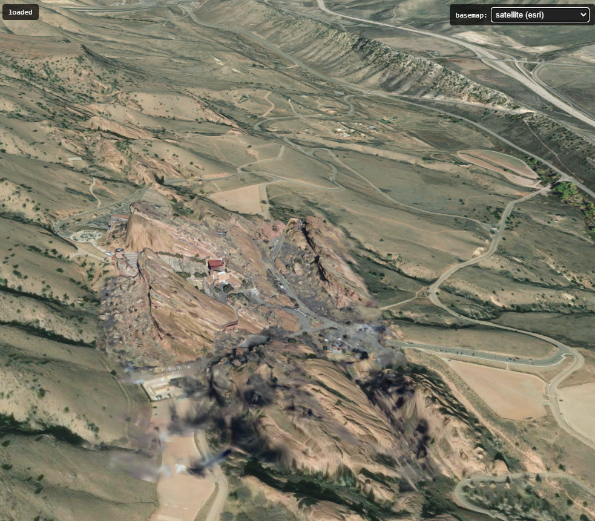

# Geo Register Plugin

Registers a [LichtFeld Studio](https://github.com/MrNeRF/LichtFeld-Studio/) scene to real-world geographic coordinates (WGS-84 / ECEF).
Once registered, clicking any point on the model returns its latitude, longitude, and altitude.
The plugin can also export geo-referenced splat models as **LAS/LAZ** point clouds or
**3D Tiles 1.1** datasets (ArcGIS Gaussian Splat Layer / CesiumJS).


---

## How It Works

The plugin solves a **similarity transform** that maps scene-space coordinates to
ECEF (Earth-Centered Earth-Fixed) coordinates:

```
world_ecef = scale * R @ p_scene + translation
```

Where:
- `scale` — uniform scale factor between scene units and metres
- `R` — 3x3 rotation matrix
- `translation` — 3D translation vector in metres

The transform is estimated using a robust RANSAC + IRLS solver (Umeyama 1991),
which automatically rejects outlier correspondences.

---

## Source Modes

Use the **Source** dropdown to choose how geographic reference data is provided.

---

### 1. EXIF

Automatically extracts GPS coordinates embedded in the original drone/camera images,
matches them to the camera poses in the loaded scene, and solves the transform.

**Steps:**
1. Load your dataset in LichtFeld Studio.
2. Select **EXIF** from the Source dropdown.
3. Click **Calc Georeference From EXIF**.

The plugin scans the dataset folder for images with GPS EXIF tags, matches each image
to its camera pose by filename stem, and runs the solver.

> **Original images folder:**
> If your dataset images no longer contain GPS EXIF data (e.g. they were undistorted
> or re-encoded), click **Set Original Images Folder** to point the plugin at the
> folder containing your original images. The plugin will scan that folder for GPS
> tags instead.
> The filename **stem** (name without extension) must match between the original
> images and the dataset cameras — for example, `DJI_0001.jpg` (original) matches
> `DJI_0001.JPG` or `DJI_0001.png` in the dataset.

> **Note:** EXIF GPS readings can be imprecise, especially in the altitude direction. For more accurate results, use professional alignment tools with GCPs (ground control points).

---

### 2. Similarity File

Loads a previously computed similarity transform from a JSON file.
Useful when you already have a valid transform (e.g. exported by this plugin from a
different session or computed externally).

**Steps:**
1. Select **Similarity File** from the Source dropdown.
2. Click **Load Similarity File** and pick a `.json` file.

**Expected JSON format:**

```json
{
  "scale": 0.999367,
  "rotation": [
    [ 0.9998,  0.0123, -0.0156],
    [-0.0121,  0.9998,  0.0089],
    [ 0.0157, -0.0087,  0.9998]
  ],
  "translation": [4052845.12, 617312.45, 4867891.78]
}
```

**Matrix composition:**

The transform applies components in this order:

1. **Scale** — multiply the scene point by `scale`
2. **Rotate** — apply the 3x3 rotation matrix `R`
3. **Translate** — add the `translation` vector

In matrix form as a 4x4 homogeneous transform:

```
| scale*R  translation |   @   | x |       | x_ecef |
|    0          1      |       | y |   =   | y_ecef |
                               | z |       | z_ecef |
                               | 1 |       |   1    |
```

The plugin exports this JSON automatically after every EXIF or CSV solve, to
`<output_dir>/geo_register_plugin_data/similarity_transform.json`.

---

### 3. Image Positions CSV

Loads image GPS positions from a CSV file and runs the same solver as the EXIF mode.
Useful when GPS data is not embedded in the images (e.g. stored separately by the
drone flight controller, or sourced from a ground control point log).

**Steps:**
1. Select **Image Positions CSV** from the Source dropdown.
2. Click **Load CSV File** and pick a `.csv` file.

**Required CSV format:**

The file must have a header row with these column names (in any order):

```
image_name,lat,lon,alt
DJI_0001.JPG,32.08154321,34.78912345,48.250
DJI_0002.JPG,32.08163897,34.78924561,48.431
DJI_0003.JPG,32.08172450,34.78937812,48.619
DJI_0004.JPG,32.08181023,34.78951034,48.802
```

- `image_name` — filename only, with extension (not a full path)
- `lat` — latitude in decimal degrees (WGS-84)
- `lon` — longitude in decimal degrees (WGS-84)
- `alt` — ellipsoidal altitude in metres

The plugin exports this CSV automatically after every EXIF solve, to
`<output_dir>/geo_register_plugin_data/image_positions.csv`.

---

### 4. RealityScan Parameters CSV

> **Recommended over EXIF when you aligned your data with RealityScan.**
>
> RealityScan performs bundle adjustment that refines each camera's position beyond
> the raw GPS reading. Importing these adjusted positions instead of raw EXIF gives
> significantly better geo-registration accuracy, because the plugin fits the
> similarity transform to coordinates that are already internally consistent with
> the reconstructed model. Expect a noticeably lower RMSE compared to EXIF mode.

**How to export from RealityScan:**

**Step 1 — Set the project output coordinate system to WGS 84:**

Go to **Workflow → Settings → Coordinate System** and set the output coordinate
system to **EPSG:4326 – GPS WGS 84**.


**Step 2 — Export Internal/External Camera Parameters:**

In the export dialog, choose **Internal/External Camera Parameters**.
In the export settings, set the coordinate system to **Project Output**.


> **Important — Colmap export:** The output coordinate system setting is **global** for
> all RealityScan exports. If you later export to **Colmap** format, you must change it
> back to **Grid Plane / Local Euclidean** — Colmap expects Euclidean (non-geographic)
> coordinates, and leaving it set to EPSG:4326 will produce incorrect results.
>
> 

**Step 3 — Load in the plugin:**

1. Select **RealityScan Parameters CSV** from the Source dropdown.
2. Click **Load RealityScan CSV** and pick the exported `.csv` file.

**CSV format (exported by RealityScan):**

```
#name,x,y,alt,yaw,pitch,roll,f_35mm,px_norm,py_norm,k1,k2,k3,k4,t1,t2
DJI_0214.JPG,-34.82878738,7.16331052,86.94,131.99,...
```

- `name` — image filename
- `x` — longitude (decimal degrees, WGS-84)
- `y` — latitude (decimal degrees, WGS-84)
- `alt` — ellipsoidal altitude in metres

All other columns (yaw, pitch, roll, lens parameters) are ignored by the plugin.

---

### 5. Metashape Cameras XML

Loads camera GPS positions from an Agisoft Metashape camera XML export and runs
the same solver as the CSV modes.

**How to export from Metashape:**

1. In Metashape, make sure the chunk's **coordinate system** is set to **WGS 84 (EPSG:4326)**.
2. Go to **File → Export → Export Cameras…** and save as XML.

**Steps in the plugin:**

1. Select **Metashape Cameras XML** from the Source dropdown.
2. Click **Load Metashape Cameras XML** and pick the exported `.xml` file.

**Requirements:**

- The chunk CRS must be **GEOGCS / EPSG:4326**. Chunks with any other CRS
  (projected, geocentric, or local) are skipped with a warning.
- Cameras with `enabled="0"` on their `<reference>` tag are skipped.
- Multiple chunks in the same file are all processed and merged.

> **Note — naive parsing:**
> The parser reads GPS coordinates directly from the `<reference>` attribute of each
> `<camera>` element. It assumes that this tag is present and populated with GPS data —
> which is the case when cameras were imported with GPS coordinates in Metashape's
> Reference pane. If a camera was added without GPS data, its `<reference>` tag will
> be absent and that camera will simply be skipped.
>
> Before loading, you can verify your file contains reference data by checking that
> individual `<camera>` entries include a `<reference>` tag with `x`, `y`, `z`
> attributes, for example:
> ```xml
> <camera id="3" sensor_id="0" label="DJI_0003.JPG" enabled="1">
>   <transform>...</transform>
>   <reference x="8.71105718333333" y="50.1547084833333" z="195.665"
>              yaw="..." pitch="0" roll="0" enabled="1"/>
> </camera>
> ```
> Here `x` = longitude, `y` = latitude, `z` = altitude in metres (WGS-84).

---

## Output Files

After a successful solve the plugin writes to `<output_dir>/geo_register_plugin_data/`:

| File | Description |
|---|---|
| `similarity_transform.json` | The solved transform (scale, R, t, RMSE, inlier counts) |
| `similarity_transform_info.txt` | Human-readable explanation of the transform fields |
| `image_positions.csv` | GPS positions of all matched images (EXIF and CSV modes) |

---

## Configuration

The plugin reads `config.json` from its root directory at runtime. All keys are optional;
the defaults below are used when a key is absent or the file does not exist.

```json
{
  "las_export_coordinates": "UTM",

  "ransac_inlier_thr_m": 10.0,
  "ransac_confidence":    0.99,
  "ransac_max_iter":      2000,
  "irls_huber_delta_m":   2.0,
  "irls_max_iter":        50
}
```

| Key | Default | Description |
|---|---|---|
| `las_export_coordinates` | `"UTM"` | Output CRS for LAS/LAZ export: `"UTM"` or `"LLA"` (EPSG:4326) |
| `ransac_inlier_thr_m` | `10.0` | RANSAC inlier threshold in metres — correspondences with a larger residual are rejected as outliers |
| `ransac_confidence` | `0.99` | Target probability that RANSAC finds the correct model; drives the adaptive iteration count |
| `ransac_max_iter` | `2000` | Hard cap on RANSAC iterations regardless of the adaptive estimate |
| `irls_huber_delta_m` | `2.0` | Huber loss delta (metres) for IRLS refinement — points below this residual receive full weight |
| `irls_max_iter` | `50` | Maximum IRLS iterations |

> **Tuning tips:**
> - Increase `ransac_inlier_thr_m` if your GPS data is noisy (e.g. consumer-grade EXIF) and the solver rejects too many correspondences.
> - Decrease it when you have RTK-quality GPS and want stricter outlier rejection.
> - `irls_huber_delta_m` should be smaller than `ransac_inlier_thr_m` — a good rule of thumb is roughly ¼ of the inlier threshold.

---

## Export

Once geo-registration is complete, the plugin can export any splat model visible in the
scene as a geo-referenced point cloud file.

The export section appears at the bottom of the panel. Use the **Splat Model** dropdown
to select which model to export, choose the output format, then click **Export LAS/LAZ**.
A save dialog opens with the splat name pre-filled as the filename. The last exported
path is shown in the panel for reference.

### LAS — LASer file format

LAS is the industry-standard binary format for point cloud data, maintained by the
[ASPRS](https://www.asprs.org/divisions-committees/lidar-division/laser-las-file-format-exchange-activities).
The plugin writes **LAS 1.4, point format 7** (XYZ + RGB colour).

The output coordinate system is controlled by `las_export_coordinates` in `config.json`
(see [Configuration](#configuration)):

| Setting | CRS | X | Y | Z |
|---|---|---|---|---|
| `"UTM"` *(default)* | WGS-84 / UTM zone auto-selected from point-cloud median | Easting (m) | Northing (m) | Ellipsoidal height (m) |
| `"LLA"` | EPSG:4326 geographic | Longitude (°) | Latitude (°) | Ellipsoidal height (m) |

When `UTM` is selected:
- The UTM zone is determined from the **median latitude and longitude** of the exported
  point cloud — a robust centroid that ignores outliers.
- Northern/southern hemisphere is set automatically from the sign of the median latitude.
- The EPSG code is derived accordingly (e.g. `EPSG:32636` for UTM zone 36N).

For both modes:
- An **OGC WKT CRS record** is embedded in the file header so any compliant GIS tool
  (QGIS, ArcGIS, CloudCompare, etc.) can read the coordinate system automatically.
- Gaussian splat positions are transformed from scene space to ECEF using the solved
  similarity transform, then converted to WGS-84 geodetic coordinates.
- Colour is taken from the first spherical harmonics band (DC term), packed as
  16-bit per channel RGB.

### LAZ — Compressed LAS

LAZ is a losslessly compressed variant of LAS. The point data and CRS metadata are
identical to LAS; only the storage is compressed using the
[LASzip](https://laszip.org/) algorithm.

- File sizes are typically **5–10× smaller** than the equivalent LAS file.
- All major GIS tools that support LAS also support LAZ.
- Requires the `lazrs` or `laszip` Python package in the plugin environment
  (installed automatically with the plugin dependencies).

### 3D Tiles



The plugin can export the splat model as a georeferenced **3D Tiles 1.1** dataset
that renders as full Gaussian splats (not a point cloud).

**Output files:**

```
out_dir/
  tileset.json   # 3D Tiles 1.1 manifest
  splats.glb     # Binary glTF — SPZ-compressed splat data in the BIN chunk
```

**Tileset structure:**

```
root  (no transform — ECEF bounding volume only)
└── child  (similarity transform: local → ECEF)
      └── content: splats.glb
```

The similarity transform computed by the geo-registration is embedded directly
as the child tile's `transform`, placing the splat cloud at the correct ECEF
position on Earth.

**Format details:**

| Property | Value |
|---|---|
| 3D Tiles version | 1.1 |
| glTF extension | `KHR_gaussian_splatting` + `KHR_gaussian_splatting_compression_spz_2` |
| Compression | SPZ v3 (gzipped), ~17 bytes/splat for SH degree 3 |
| SH bands | Up to degree 3 (full view-dependent colour) |
| Tested on | ArcGIS Maps SDK 5.0 — should also work on CesiumJS ≥ 1.139 and ArcGIS Pro ≥ 3.6 |

**[`KHR_gaussian_splatting`](https://github.com/KhronosGroup/glTF/tree/main/extensions/2.0/Khronos/KHR_gaussian_splatting)**
is a ratified Khronos glTF 2.0 extension for embedding 3D Gaussian Splat data inside
a standard glTF/GLB asset. It defines per-primitive attributes for position, rotation,
scale, opacity, and spherical harmonic coefficients, with a companion compression
extension (`KHR_gaussian_splatting_compression_spz_2`) that wraps the payload in an
SPZ blob.

**SPZ (Splat Zip) v3** is an open binary format for compact Gaussian splat storage,
developed by [Niantic Labs](https://github.com/nianticlabs/spz) (MIT licence).
It encodes positions, rotations, scales, opacity, and spherical harmonic coefficients
into a single gzipped binary blob (~17 bytes/splat at SH degree 3, roughly 14× smaller
than the source PLY). The encoder used here is a pure-Python implementation that mirrors
the Niantic reference byte-for-byte.

---

## No Scene Plugin Functionality

When LichtFeld Studio is in **Edit Mode** (no scene loaded), geo-registration is not
possible because there are no camera poses to fit the similarity transform against.

However, the plugin remains useful: if you already have a **pre-calculated similarity
matrix** (computed during a previous session while a scene was loaded), you can still
convert any 3DGS PLY file to a geo-referenced export format without reloading the scene.

> **Important:** the similarity matrix must have been calculated with a scene still
> loaded in LichtFeld Studio. You cannot compute it in Edit Mode.

**Steps:**

1. Switch to **Edit Mode** in LichtFeld Studio (or open it without a scene).
2. The Geo Register Plugin panel automatically switches to **PLY → Geo Export** mode.
3. Click **Pick PLY File** and select your 3DGS `.ply` file.
4. Click **Pick Similarity JSON** and select the pre-calculated `similarity_transform.json`.
5. Once both files are selected, choose the output **Format** and export destination.
6. Click **Export** — the plugin converts the PLY directly to the chosen format
   (LAS, LAZ, or 3D Tiles) using the stored similarity transform.

The similarity JSON format is the same as described in the [Similarity File](#2-similarity-file)
source mode section above. The plugin exports this file automatically to
`<output_dir>/geo_register_plugin_data/similarity_transform.json` after every successful solve.
